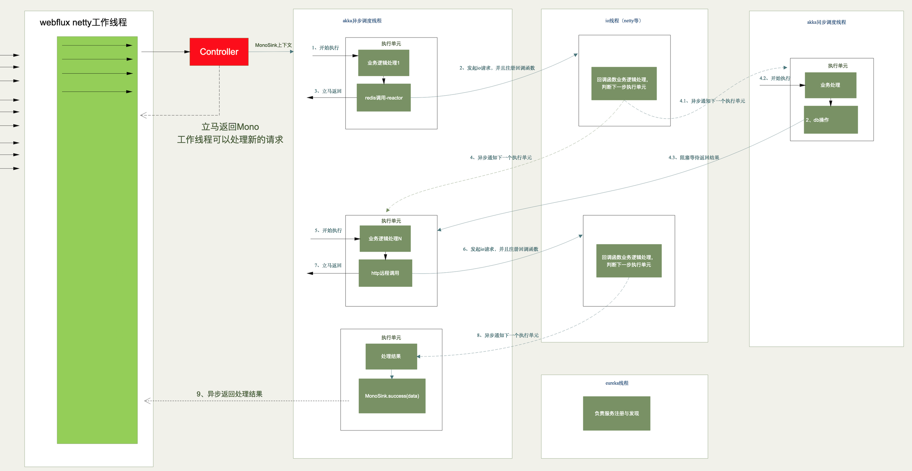
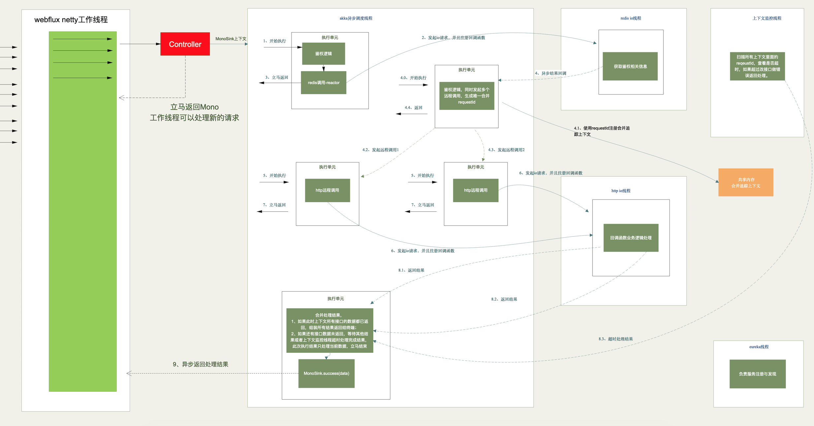

## 异步模型


## 同步模型


## 组件选型
```
1、SpringBoot 2.x 的WebFlux直接提供异步容器
2、Lettuce客户端支持netty实现的reactor客户端
3、HttpComponets组件httpclient4.5支持异步client
4、Akka、Reactor-core异步执行框架
5、目前支持ractor的数据库，redis，mongo


6、封装topo组装细节，封装回调函数注册细节，开发者不用关注akka调度细节，开发者使用同步编程思维决定下一步要做什么。
7、统一超时监控
```


## 严格超时监控
```
1、单个异步执行单元不能超过5ms
2、单个同步执行单元不能到过50ms
3、整个业务执行时间不能超过1000ms
```
feture-002-1
feture-002-2


second

## 聚合网关


## 压测性能


## 开发成本


## 业务代码编写
```
@RequestMapping(value = "/sayHello",method = RequestMethod.GET)
    public Mono<String> sayHello(){
    //    feignClientSao.hi2("uft-8",111L,"name","body","aaa");
        Map<String,Object> requestData = new HashMap<>();
        requestData.put("userId","16999999");
        Mono<String> kk = Mono.just("hello");
            return  ActorTopo.newBuilder(ActorGroupIdEnum.SAY_HELLO)
                    .frist(SayHelloFristActor.class)
                    .topo(SyncDBActor.class, SayHelloHttpGetActor.class, SayHelloHttpPutActor.class, SayHelloHttpPostActor.class,SayHelloHttpDeleteActor.class)
                    .parall(20)
                    .build()
                    .start(requestData);
    }
```

```
public class SayHelloHttpPostActor extends AbstractHttpActor {


    @Override
    public HttpRequest buildExecuteData(ActContext context) {
        //组装http请求信息，具体请求由框架执行
        SimpleClass body = new SimpleClass();
        body.setCode("200");
        body.setMsg("OK");
        return new HttpRequest().withServiceName("feign-server")
                .withRequestPath("/test2/ha{name}")
                .withRequestMethod(Request.HttpMethod.POST)
                .withParam("number",(Integer.valueOf((String) context.getResponseData().get("GETDATA")))+"1")
                .withPathVarible("name","jett")
                .withHeader("header1","headervalue")
                .withRequestBody(JSON.toJSONString(body));
    }

    @Override
    public Class<? extends BaseActor> executeNextOnSuccess(ActContext context, Object data) {
        //异步http执行完以后的操作,返回null就直接走responseActor
        Map<String,Object> result = new HashMap<>();
        result.put("CODE","200");
        result.put("MSG","OK");
        result.put("POSTDATA",data);
        context.setResponseData(result);
        return SayHelloHttpPutActor.class;
    }


    @Override
    public Class<? extends BaseActor> executeNextOnError(ActContext context, Throwable exception) {
        return null;
    }
}
```


last